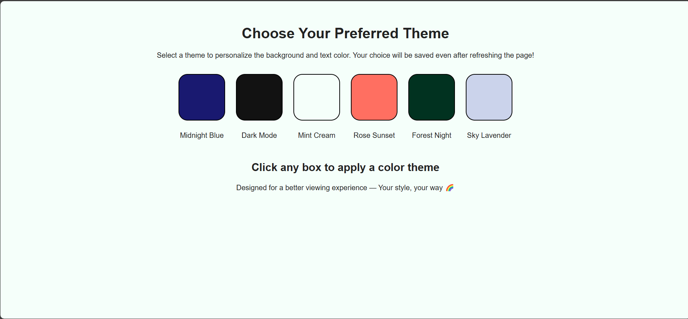
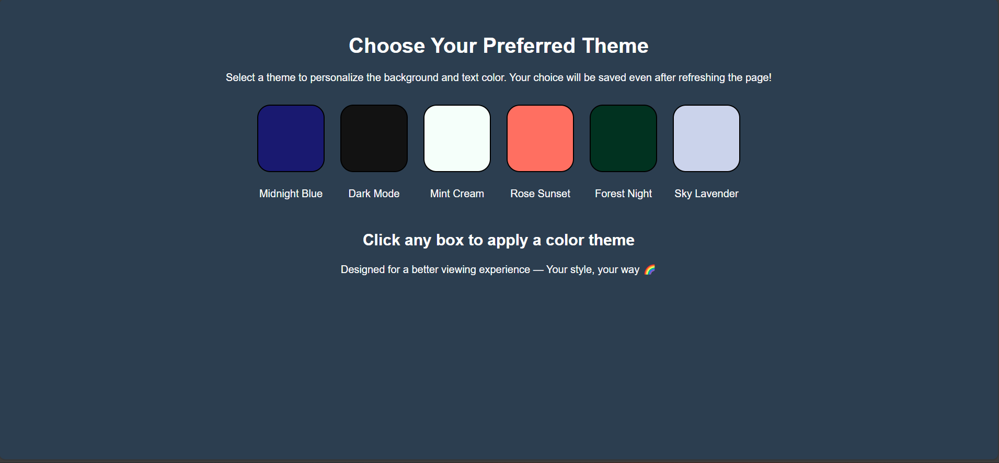
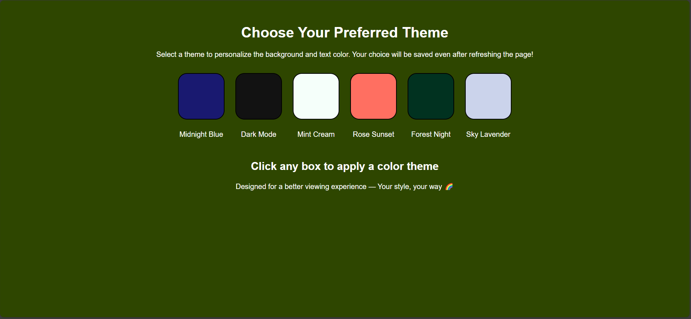

# 🌈 Theme Changer

A simple yet stylish web app that allows users to switch between different background color themes. The app also remembers the selected theme using `localStorage`, so it stays applied even after refreshing!

## 🚀 Features

- Clickable color boxes to change background theme
- Dark mode themes with automatic text color adjustment
- Persists selected theme using `localStorage`
- Responsive and clean design

## 🛠️ Technologies Used

- HTML5
- CSS3
- JavaScript (Vanilla)

  # Theme Changer Project

## 📦 How to Use

1. Clone the repository:
    ```bash
    git clone https://github.com/subrata-24/theme-changer.git
    ```

2. Open `index.html` in your browser.

Enjoy your personalized color theme experience!

---

## ✨ Author

**Subrata Biswas** — [GitHub](https://github.com/subrata-24)

---

## 📸 Screenshot

### Light Mode


### Dark Mode


### Dark Mode


### Dark Mode


## 🗂️ Project Structure

