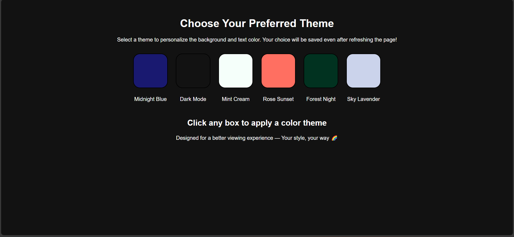

# 🌈 Theme Changer

A simple yet stylish web app that allows users to switch between different background color themes. The app also remembers the selected theme using `localStorage`, so it stays applied even after refreshing!

## 🚀 Features

- Clickable color boxes to change background theme
- Dark mode themes with automatic text color adjustment
- Persists selected theme using `localStorage`
- Responsive and clean design

## 🛠️ Technologies Used

- HTML5
- CSS3
- JavaScript (Vanilla)

## 📸 Screenshot

### Light Mode

### Dark Mode

## 🗂️ Project Structure

